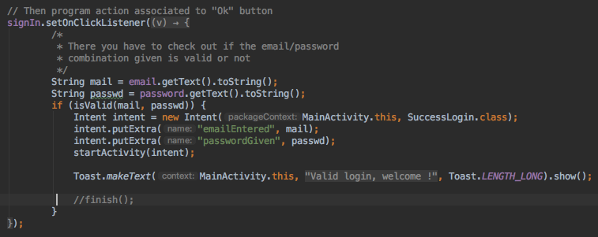
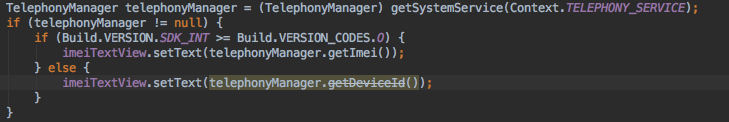

# SYM_Labo1 - Réponses aux questions

Auteurs: J.Châtillon, A.Rochat, B.Schopfer
Date du rendu: 07.10.2018

## Question 1

```
Comment organiser les textes pour obtenir une application multi-langues (français, allemand, italien, langue par défaut : anglais) ?
Que se passe-t-il si une traduction est manquante dans la langue par défaut ou dans une langue supplémentaire ?
```

Il ne faut jamais coder en dur du texte.  Lorsqu'on souhaite afficher du texte dans l'application, il faut aller récupérer des textes dans le(s) fichier(s) *strings.xml*. Ceci permet de gérer facilement les traductions.

Pour la langue par défaut, il faut créer un fichier *strings.xml* dans le dossier *./res/values/*. Pour chaque autre  langues, il faut créer un fichier *strings.xml* contenant les traductions de chaque string de la langue par défaut, mais situé dans un autres dossier *./res/values-XX/* ou XX représente le code (sur 2 caractères) du language. Il est aussi possible de préciser la région ou d'utiliser un "BCP 47 language tag". (cf: https://developer.android.com/guide/topics/resources/providing-resources#AlternativeResources).

Les fichiers *strings.xml* doivent avoir la structure suivante:

```xml
<?xml version="1.0" encoding="utf-8"?>
<resources>
    <string name="refExemple">Text exemple</string>
</resources>
```

Entre les banières *\<resources>* se trouvent toutes les strings de l'application. Chaque string est identifiée par un nom (*name*), identique d'une traduction à l'autre. Seule la valeur entre les balises \<string> et \</string> changent en fonction de la langue.

Dans le code, on récupère la valeur d'une string en utilisant l'instruction:

```java
getResources().getString(R.string.refExemple); // récupère le string depuis le code Java
```

```xml
<TextView android:text="@string/refExemple" /> // récupère le string dans le fichier xml
```

Si une traduction est manquante dans une langue supplémentaire, alors le texte de la langue par défaut sera affichée. En revanche, le fichier *string.xml* de la langue par défaut doit être complet sans quoi l'application ne pourra pas compiler. 

La langue utilisée sera automatiquement définie en fonction des traductions proposées par l'application et des réglages du système sur lequel l'application est lancée. L'appareil fera en sorte de choisir la traduction la plus spécifique en fonction des traductions proposées et prendra la langue par défaut si aucune autre traduction ne convient.

## Question 2

```
Dans l’exemple fourni, sur le dialogue pop-up, nous affichons l’icône android. R.drawable.ic_dialog_alert , disponible dans le SDK Android mais qui n’est pas très bien adapté visuellement à notre utilisation. Nous souhaitons la remplacer avec notre propre icône, veuillez indiquer comment procéder. Dans quel(s) dossier(s) devons-nous ajouter cette image ? Décrivez brièvement la logique derrière la gestion des ressources de type « image » sur Android.
```

Il faut ajouter l'icone que nous souhaitons utiliser dans le dossier *res/drawable*. Après cela, on remplace la ligne 

```
alertbd.setIcon(android.R.drawable.ic_dialog_alert);
```

par

```
alertbd.setIcon(R.drawable.ic_warning_black_24dp);
```

où *ic_warning_black_24dp* est le nom de l'icone.

Dans Android Studio, le moyen le plus simple d'ajouter une icône est d'utiliser le menu File -> New -> Vector Asset. Le menu qui s'ouvre permet de choisir une icône personnalisée (à donner au format SVG ou PSD) ou de choisir une icône open source (*Clip ARt*) dans le style *Material Design*.

Android Studio gère les icônes à l'aide de format vectoriel. Ainsi, il n'est pas nécessaire de créer tous les fichiers correspondant aux différentes tailles d'écran.

En revanche, lorsqu'on utilise des images, il est important de le faire. Dans ce cas, il faut créer un dossier *res/drawable-xxx* (où xxx correspond à la résolution de l'écran, comme par exemple *hdpi*, *tvdpi* ou encore *xxxhdpi*) pour chaque résolution et placer l'image à la bonne dimension dans chaque dossier.


Le redimensionnement des images n'est pas géré par défaut par Android Studio, mais certain plugin permettent de le faire automatiquement, comme le plugin *Android Drawable Importer* (https://plugins.jetbrains.com/plugin/7658-android-drawable-importer)

## Question 3

```
Lorsque le login est réussi, vous êtes censé chaîner une autre Activity en utilisant un Intent. Si je presse le bouton "Back" de l'interface Android, que puis-je constater ? Comment faire pour que l'application se comporte de manière plus logique ? Veuillez discuter de la logique derrière les activités Android.
```

Appuyer sur le bouton back "quitte" l'application (retour à l'écran d'accueil). La logique voudrait qu'appuyer sur retour nous déconnecte et nous ramène à la page de login.

Lorsqu'on crée un nouvel Intent (une nouvelle activité), la nouvelle vue est "empilée" par dessus son parent dans une pile. Ainsi, lorsqu'on appuie sur le bouton "Back" de l'interface Android, la méthode *finish()* est appelée et quitte la vue actuelle. Cette vue est alors retirée de la pile et la vue située en dessous est alors affichée.

Dans notre cas, cela n'affiche pas la mainActivity mais quitte l'application car la mainActivity a déjà été fermée. Elle ne se trouve donc plus dans la pile.

Pour que ça ne soit pas le cas, il suffit de commenter l'appel à la méthode *finish()* comme montré dans la capture ci-dessous.



## Question 4

```
On pourrait imaginer une situation où cette seconde Activity fournit un résultat (par exemple l’IMEI ou une autre chaîne de caractères) que nous voudrions récupérer dans l'Activity de départ. Comment procéder ?
```

Pour récupérer des informations dans une activité enfant, il faut utiliser la méthode *startActivityForResult()* au lieu de la méthode *startActivity()* afin de démarrer l'activité enfant.

Plus d'infos ici: https://developer.android.com/training/basics/intents/result

## Question 5

```
Vous noterez que la méthode getDeviceId() du TelephonyManager, permettant d’obtenir l’IMEI du téléphone, est dépréciée depuis la version 26 de l’API. Veuillez discuter de ce que cela implique lors du développement et de présenter une façon d’en tenir compte avec un exemple de code.
```

Une méthode dépréciée est succeptible de disparaître dans une prochaine version de l'API. Il est donc préférable de ne plus l'utiliser... Cela pose plusieurs problèmes. Pour garder la compatibilité avec les anciennes version de l'API, il faut utiliser cette méthode, mais pour avoir la compatibilité avec les versions futures de l'API, il faut utiliser la nouvelle méthode (dans notre cas, *getImei()*).

Il faut donc, au runtime, déterminer la version de l'API de l'appareil sur lequel est lancé l'application! Le seul moyen de faire cela est de faire un test à l'aide d'un if, comme montré dans la capture ci-dessous:

 

## Question 6

```
Dans l’activité de login, en plaçant le téléphone (ou l’émulateur) en mode paysage (landscape), nous constatons que les 2 champs de saisie ainsi que le bouton s’étendent sur toute la largeur de l’écran. Veuillez réaliser un layout spécifique au mode paysage qui permet un affichage mieux adapté et indiquer comment faire pour qu’il soit utilisé automatiquement à l’exécution.
```

Réaliser un layout spécifique au mode paysage est très facile. Il suffit de créer un dossier *res/layout-land* et d'y placer un fichier xml décrivant chaque vue en mode paysage.

L'application utilisera automatiquement le layout vertical ou horizontal en fonction de l'orientation de l'appareil et switchera de l'un à l'autre si nécessaire.

## Question 7

```
Le layout de l’interface utilisateur de l’activité de login qui vous a été fourni a été réalisé avec un LinearLayout à la racine. Nous vous demandons de réaliser un layout  équivalent utilisant cette fois-ci un RelativeLayout.
```

Voici le code du *RelativeLayout*:

```xml
<?xml version="1.0" encoding="utf-8"?>
<RelativeLayout xmlns:android="http://schemas.android.com/apk/res/android"
    android:layout_width="match_parent"
    android:layout_height="match_parent"
    android:orientation="vertical" >

    <EditText
        android:id="@+id/email"
        android:layout_width="match_parent"
        android:layout_height="wrap_content"
        android:hint="@string/email"
        android:inputType="textEmailAddress" >
        <requestFocus />
    </EditText>

    <EditText
        android:id="@+id/password"
        android:layout_width="match_parent"
        android:layout_height="wrap_content"
        android:hint="@string/psw"
        android:inputType="textPassword"
        android:layout_alignParentStart="true"
        android:layout_below="@+id/email"
        android:layout_alignParentLeft="true">

        <requestFocus/>
    </EditText>

    <Button
        android:id="@+id/buttOk"
        android:layout_width="match_parent"
        android:layout_height="wrap_content"
        android:text="@string/signin"
        android:layout_alignParentStart="true"
        android:layout_alignParentTop="true"
        android:layout_marginTop="220dp"
        android:layout_alignParentLeft="true"/>

</RelativeLayout>
```

## Question 8

```
Implémenter dans votre code les méthodes onCreate(), onStart(), onResume(), onPause(), onStop(), etc... qui marquent le cycle de vie d'une application Android, et tracez leur exécution dans le logcat. Décrivez brièvement à quelles occasions ces méthodes sont invoquées. Si vous aviez (par exemple) une connexion Bluetooth (ou des connexions bases de données, ou des capteurs activés) ouverte dans votre Activity, que faudrait-il peut-être faire, à votre avis (nous ne vous demandons pas de code ici) ?
```

#### OnCreate()

La méthode *onCreate()* est appelée lors de la première création de l'activité. Par exemple, lorsqu'on démarre l'application alors qu'elle ne tourne pas en background, c'est la méthode *onCreate()* de l'activité principale qui est appelée. Dans notre code, cette méthode est aussi appelée lorsqu'on appelle la méthode *startActivity()* puisqu'elle crée une nouvelle activité.

C'est ici qu'il faut créer les vues, remplir les listes avec des données etc.

[https://developer.android.com/reference/android/app/Activity#onCreate(android.os.Bundle)](https://developer.android.com/reference/android/app/Activity#onCreate(android.os.Bundle))

#### onRestart()

La méthode onRestart() est appelée lorsque l'activité est redémarée après avoir été stoppée, 

[https://developer.android.com/reference/android/app/Activity.html#onRestart()](https://developer.android.com/reference/android/app/Activity.html#onRestart())

#### OnStart()

La méthode *onStart()* est appelée lorsque l'activité devient visible pour l'utilisateur.

[https://developer.android.com/reference/android/app/Activity.html#onStart()](https://developer.android.com/reference/android/app/Activity.html#onStart())

#### onResume()

La méthode *onResume()* est appelée lorsque l'utilisateur peut commencer à interagir avec l'activité.

[https://developer.android.com/reference/android/app/Activity.html#onResume()](https://developer.android.com/reference/android/app/Activity.html#onResume())

#### onPause()

La méthode *onPause()* est appelée lorsque le système va revenir à une activité précédente, comme par exemple lors de l'appui sur le bouton "Back", ou lors du retour au "home screen".
C'est généralement ici qu'il faut enregistrer d'éventuels changements dans les données persistantes et arrêter les tâches qui pourraient consommer du CPU.

[https://developer.android.com/reference/android/app/Activity.html#onPause()](https://developer.android.com/reference/android/app/Activity.html#onPause())

#### onStop()

La méthode *onStop()* est appelée lorsque l'activité n'est plus visible pour l'utilisateur car elle a été remplacée par une autre. 

[https://developer.android.com/reference/android/app/Activity.html#onStop()](https://developer.android.com/reference/android/app/Activity.html#onStop())

#### onDestroy()

La méthode *onDestroy()* est la dernière méthode appelée avant que l'activité soit détruite. Cela peut se produire car la méthode *finish()* a été explicitement appelée ou parce que le système a décidé de détruire cette activité afin de récupérer la mémoire qu'elle occupe.

[https://developer.android.com/reference/android/app/Activity.html#onDestroy()](https://developer.android.com/reference/android/app/Activity.html#onDestroy())

## Question 9

```
Facultatif – Question Bonus - S’il vous reste du temps, nous vous conseillons de le consacrer à mettre en place la résolution des permissions au runtime.
```

La résolution des permissions au runtime a été effectuée à l'aide de la libraire Dexter (https://github.com/Karumi/Dexter) qui simplifie grandement la gestion des permissions!

Voici le code que nous avons produit:

```java
// on demande la permission à l'utilisateur
Dexter.withActivity(this)
      .withPermissions(Manifest.permission.READ_PHONE_STATE, Manifest.permission.READ_EXTERNAL_STORAGE)
      .withListener(new MultiplePermissionsListener() {
         @SuppressLint("MissingPermission")
         @Override
         public void onPermissionsChecked(MultiplePermissionsReport report) {
            List<PermissionGrantedResponse> permissionsGranted = report.getGrantedPermissionResponses();
            for (PermissionGrantedResponse permission : permissionsGranted) {
               if (permission.getPermissionName().equals(Manifest.permission.READ_EXTERNAL_STORAGE)) {
                  // autorisation de l'accès au stockage accordée -> on modifie l'image
                  File file = Environment.getExternalStoragePublicDirectory(Environment.DIRECTORY_DOWNLOADS + "/perso.jpg");
                  if (file.exists()) {
                     Bitmap profileBitmap = BitmapFactory.decodeFile(file.getAbsolutePath());
                     imageView.setImageBitmap(profileBitmap);
                  }
               }
               if (permission.getPermissionName().equals(Manifest.permission.READ_PHONE_STATE)) {
                  // autorisation de l'accès aux infos du téléphone accordée -> on modifie l'imei
                  TelephonyManager telephonyManager = (TelephonyManager) getSystemService(Context.TELEPHONY_SERVICE);
                  if (telephonyManager != null) {
                     if (Build.VERSION.SDK_INT >= Build.VERSION_CODES.O) {
                        imeiTextView.setText(telephonyManager.getImei());
                     } else {
                        imeiTextView.setText(telephonyManager.getDeviceId());
                     }
                  }
               }
            }
         }
         
         @Override
         public void onPermissionRationaleShouldBeShown(List<PermissionRequest> permissions, PermissionToken token) {
            token.continuePermissionRequest();
         }
         
      }).onSameThread().check();
```